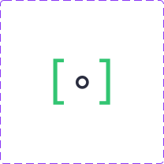

  
  
  

  <picture>
    <source media="(prefers-color-scheme: dark)" srcset="assets/hero-dark.svg"/>
    <source media="(prefers-color-scheme: light)" srcset="assets/hero-light.svg"/>
    
  </picture>

  <strong>noricore</strong> is the event broker and data backbone of the <strong>norikit</strong> ecosystem. 
  It aggregates system state from native macOS APIs and distributes it to all norikit tools 
  and third-party clients — replacing per-tool polling with a single, shared source of truth.

> [!NOTE]
> Work in progress. noricore is in early development and not yet usable.

## About

A [**norikit**](https://github.com/norikit) project — part of a suite of native macOS
desktop-customization tools, built to be fast and visually cohesive.

noricore runs as a background daemon and serves as the canonical data source for the
ecosystem. Tools like [noribar](https://github.com/norikit/noribar) subscribe to noricore
for battery level, active app, network status, CPU usage, and more — rather than each
polling the same system APIs independently. Third-party tools can connect to the same
interface to consume or publish events.

## Documentation

Design knowledge lives in the **[`ai-docs/`](ai-docs/)** knowledge base. Active work is
tracked under **[`tasks/`](tasks/)**.

> **Working in this repo with an AI agent?** Start at [`CLAUDE.md`](CLAUDE.md).

## Building

Requires macOS 13+.

<!-- Document the headless self-test invocation and the real run invocation once code exists. -->

## License

[AGPL-3.0](LICENSE).
